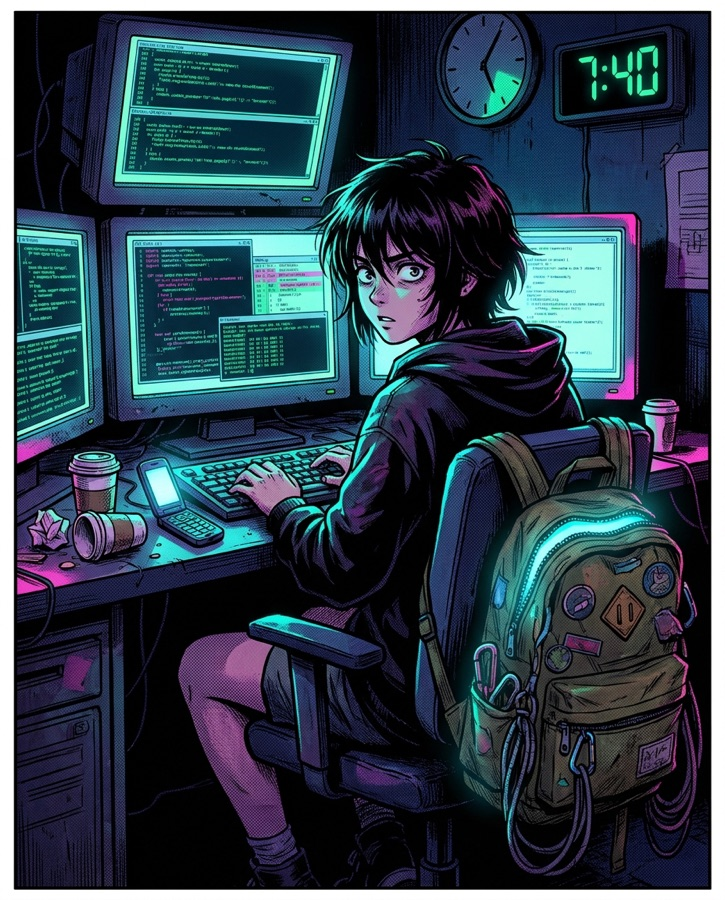
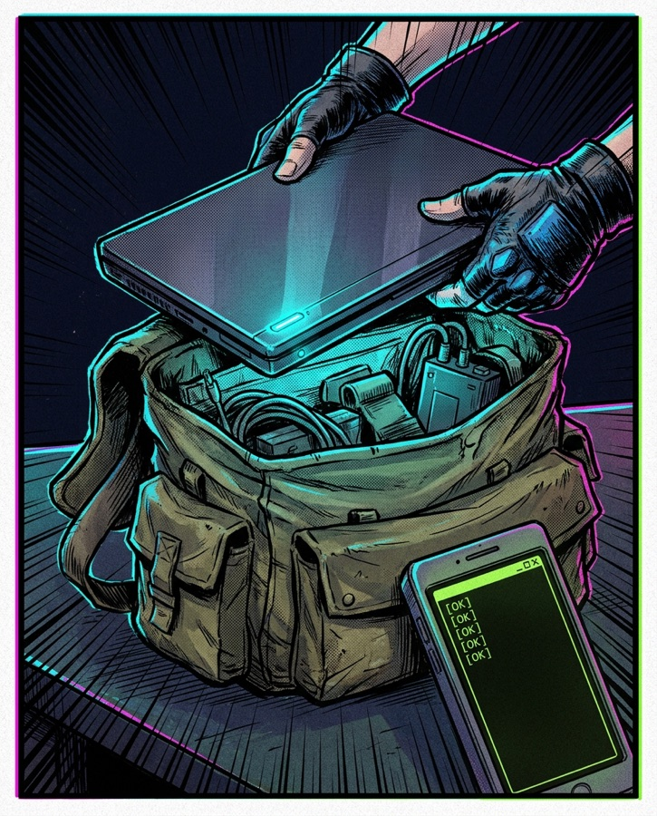

<p align="center">
  
</p>

<h1 align="center">🎒 RUCKSACK</h1>

<p align="center"><strong>Pack your agents.</strong><br>
Your coding agents keep working — lid closed, in the bag, on your phone's hotspot.</p>

<p align="center">
  
  
  
  
  
</p>

```sh
curl -fsSL https://rucksack.sh/install | bash
```

> Live at [rucksack.sh](https://rucksack.sh). Prefer to do it by hand? `git clone` this repo, `npm install && npm link`, done.

---

You kicked off a long agent run. Codex is mid-refactor, Claude is grinding through a migration — and you have to leave. Close the lid and macOS kills everything. Rucksack is the ritual for walking out the door anyway:

- **Checks everything first** — battery, hotspot, *real* internet (captive-portal probe), your agent remotes. Nine checks, one command.
- **Keeps the Mac awake with the lid closed** — `sudo pmset` with your previous setting saved, verified, and restored on stop. Not a hack; a lifecycle.
- **Watches the link while you move** — a watchdog rejoins the hotspot when Wi-Fi drops and revives the keep-awake process if it dies.
- **Pings your phone when something breaks** — link lost, link restored, process revived. One ntfy.sh URL, zero infrastructure.

> **Native remote control lets you steer the agent. Rucksack keeps the host alive and reachable while you move.** Codex, Claude, and friends already ship the phone-facing half; Rucksack is the other half — the ritual that makes sure the laptop is still awake, online, and on the right network when you reach for it.

## The run

<table>
  <tr>
    <td width="25%"><br><sub><b>01 · DEADLINE</b><br>19:42. The agents are mid-refactor. You have to leave.</sub></td>
    <td width="25%"><br><sub><b>02 · PACK</b><br><code>rucksack pack --lid-closed --yes --watch</code> — every check green. Zip it.</sub></td>
    <td width="25%"><br><sub><b>03 · TRANSIT</b><br>Hotspot drops? The watchdog rejoins and pings your phone.</sub></td>
    <td width="25%"><br><sub><b>04 · ARRIVAL</b><br>Arrive. Unpack. The work never stopped.</sub></td>
  </tr>
</table>

## Loadout

```sh
rucksack doctor                          # nine readiness checks, one verdict
rucksack pack --lid-closed --yes --watch # backpack mode: pmset + watchdog
rucksack pack --expose 3000              # + phone-tappable dev URLs, pushed via ntfy
rucksack notify test                     # prove the phone alerts work
rucksack hotspot connect "My iPhone"     # join the hotspot from Keychain
rucksack status                          # what's running, what's watching
rucksack unpack                          # stop, restore sleep settings, clean up
```

`pack`/`unpack` are the travel aliases for `start`/`stop`. Every mutating command takes `--dry-run`.

## Install (today, by hand)

```sh
git clone https://github.com/mkrecny/rucksack.git
cd rucksack
npm install
npm link
rucksack init --hotspot "My iPhone"
rucksack doctor
```

Requires Node 20+ on macOS — or, experimentally, on a Windows laptop [under WSL2](#windows-under-wsl-experimental). No runtime dependencies — the CLI is plain Node against `pmset`, `caffeinate`, `networksetup`, and `curl` on macOS, and against `powershell.exe`, `powercfg.exe`, and `netsh.exe` through WSL interop on Windows.

## Field manual

### Doctor

```sh
rucksack doctor --remote codex
```

Checks macOS, power tools, battery threshold, hotspot SSID, real internet reachability (via `captive.apple.com` — works even when macOS redacts the SSID), Tailscale (optional — see below), and each configured agent remote.

On newer macOS versions, SSID access can be privacy-redacted for terminal processes. If `doctor` says Wi-Fi is active but the SSID is redacted, either grant Location Services access to your terminal or opt in with `--allow-redacted-ssid` — the connectivity probe still gives you real assurance the link works.

### Lid-closed mode (backpack mode)

This is the mode the project is named for. On battery power, macOS sleeps a laptop when the lid closes and `caffeinate` cannot prevent it — so for the bag, Rucksack uses `sudo pmset -a disablesleep 1` and saves the previous `disablesleep` value so `rucksack stop` restores it. (It saves and restores the one `disablesleep` value with `pmset -a`; if you have set different sleep settings per power source, restore your saved value rather than assume a byte-for-byte profile snapshot.) Plain `caffeinate` mode is for lid-open use. (On [Windows under WSL](#windows-under-wsl-experimental), the same mode sets the Windows lid-close action to "Do nothing" with a single UAC-elevated `powercfg` write, and restores it on stop.)

```sh
rucksack start --hotspot "My iPhone" --remote codex --lid-closed --yes
rucksack stop
```

### The watchdog

`--watch` keeps a watchdog running after you leave. Every 20 seconds (configurable with `--watch-interval` or `watch.intervalSeconds`) it rejoins the hotspot if Wi-Fi dropped, restarts `caffeinate` if it died, watches battery and thermal pressure (below), and logs to `watch.log` next to the session state file. `rucksack stop` shuts it down with the rest of the session.

### Battery and thermal safety

A laptop that passed pre-flight at 40% can run builds for an hour in the bag. With the watchdog running, two thresholds guard the trip (both enable `--watch` automatically):

```sh
rucksack pack --lid-closed --yes --warn-battery 20 --sleep-battery 10
```

- **`--warn-battery 20`** — at 20% on battery, ping your phone: *"battery is 20% and falling."*
- **`--sleep-battery 10`** (the safety floor) — at 10% on battery, the watchdog **restores normal sleep** (undoes lid-closed mode) so the Mac sleeps and preserves your work instead of running the battery flat. It pings your phone and won't re-trip.
- **Thermal** — the watchdog reads `pmset -g therm` every tick and pings once if macOS starts throttling the CPU under thermal pressure inside the bag.

If the floor trips, `rucksack recover` (or `unpack`) cleans up as usual; the sleep setting is already restored.

### Recovery

`rucksack recover` is the reassurance command for a tool that changes global power settings. It kills any leftover keep-awake/watchdog processes and restores the saved `disablesleep` value from the session state. If it finds no session but `disablesleep` is still stuck at `1`, it tells you and, with `--yes`, restores normal sleep. Use it if a session was interrupted (crash, force-quit, killed watchdog) and you want to be certain the Mac is back to normal.

### Phone alerts

Point `notify.url` (or `--notify-url`) at an [ntfy.sh](https://ntfy.sh) topic — or any webhook that accepts a POSTed text body — and subscribe to that topic on your phone. The watchdog pings you on link-lost, link-restored, and process-revived transitions.

```sh
rucksack notify test --notify-url https://ntfy.sh/your-private-topic
rucksack pack --hotspot "My iPhone" --lid-closed --yes --watch --notify-url https://ntfy.sh/your-private-topic
```

### Phone URLs for dev servers (--expose)

The phone and the Mac share the hotspot's tiny LAN, so "localhost:3000 on your phone" is really `http://<the-Mac's-hotspot-IP>:3000`. Tell Rucksack which ports matter and the pre-flight ritual covers them too:

```sh
rucksack pack --expose 3000 --notify-url https://ntfy.sh/your-private-topic
```

- **Pack prints the URLs to tap** — `http://172.20.10.2:3000 · http://macbook.local:3000` — pushes them to your ntfy topic so they're on the phone when you are, and stores them in the session so `rucksack status` re-prints them at the café.
- **Doctor checks the bind address** — a dev server bound to `127.0.0.1` is invisible to the phone, so `rucksack doctor --expose 3000` warns and names the fix: restart with `--host 0.0.0.0` (Vite needs `--host`, CRA needs `HOST=0.0.0.0`; Next.js already binds wide).
- **Doctor flags the firewall-dialog trap** — with the macOS application firewall on, the *first* inbound connection to a new server can pop an Allow dialog that nobody can click with the lid closed. Open the URL from the phone once before you zip, or pre-allow the binary. (Block-all mode fails the check outright — the phone would never get through.)

Want literal `localhost:3000` in the phone's browser? Port-forward over ssh from Blink or Termius — `ssh -L 3000:localhost:3000 you@172.20.10.2` — and Safari's `localhost` *is* the Mac's loopback. Need HTTPS for secure-context APIs? `tailscale serve 3000` on the optional tailnet gives you a real cert.

On Windows/WSL, `--expose` reports honestly: WSL's default NAT hides listeners from the hotspot, so doctor says whether mirrored networking (`networkingMode=mirrored`) or a `netsh portproxy` is needed.

### Tailnet (optional)

Tailscale is entirely optional. Agent CLIs with their own remote surfaces (such as `codex remote-control`, or Claude Code steered through claude.ai/code) make outbound connections only — your phone never needs to reach the Mac directly. A tailnet only matters if you want direct access from the phone (ssh, Termius, screen sharing). If Tailscale *is* installed, `doctor` verifies the backend is running and reports the Mac's tailnet name; without it the check simply skips. Pass `--require-tailnet` only if the tailnet is part of your own workflow.

### Config

Default path: `~/.rucksack/config.json` (create it with `rucksack init --hotspot "My iPhone"`).

```json
{
  "version": 1,
  "hotspot": {
    "ssid": "My iPhone",
    "strict": true,
    "allowRedactedSsid": false
  },
  "power": {
    "minimumBatteryPercent": 35,
    "lidClosed": false,
    "warnBatteryPercent": null,
    "floorBatteryPercent": null
  },
  "watch": {
    "enabled": false,
    "intervalSeconds": 20
  },
  "notify": {
    "url": ""
  },
  "tailnet": {
    "required": false
  },
  "expose": {
    "ports": []
  },
  "remotes": [
    {
      "name": "codex",
      "command": "codex",
      "required": false,
      "statusCommand": "pgrep -f 'codex remote-control'",
      "startCommand": "codex remote-control"
    }
  ]
}
```

Remote-control commands stay configurable because each agent CLI exposes different verbs. Two presets ship working out of the box:

- **Codex** — `codex remote-control` runs the daemon (there is no `status` verb, so `pgrep -f 'codex remote-control'` checks the process).
- **Claude** — Claude Code now ships remote control: `claude remote-control` runs a persistent server that connects to claude.ai/code and the Claude mobile app while execution stays local. `pgrep -f 'claude remote-control'` is a reliable check. (Requires a Claude subscription, `claude` already authenticated, and the working directory trusted once — see the setup guide below.)

`agy` and `grok` remain empty presets — fill in their `statusCommand`/`startCommand` if they gain a local remote surface. With `--start-remotes`, Rucksack starts a missing remote detached (so long-running daemons work) and re-checks after a grace period.

### Setup: pairing your phone with the agent

Rucksack keeps the host alive and reachable; the agent's own remote-control feature is what you actually steer from your phone. Set that half up once:

**Codex**

1. Enable mobile access in Codex and sign in on your phone.
2. Confirm the Mac shows up as online in the Codex mobile app.
3. `rucksack doctor --remote codex` (it verifies the daemon via `pgrep`).
4. Pack.

**Claude**

1. Run `claude remote-control` once; scan the QR / open the URL to link claude.ai/code or the Claude app.
2. Confirm the session appears in Claude mobile and that `claude` is authenticated (`claude` runs cleanly in your project once, so the directory is trusted).
3. `rucksack doctor --remote claude`.
4. Pack.

## Security

Rucksack runs `sudo` and changes global power settings, so it tries to earn that trust:

- **Secrets stay locked down.** `~/.rucksack/` is created `0700`, and `config.json`, `session.json`, and `watch.log` are written `0600`. An ntfy topic or webhook URL is effectively a capability secret — anyone who learns it can post to (or read) your alerts.
- **The notify URL never rides in `argv`.** The long-lived watchdog is launched without `--notify-url` on its command line (which any `ps` could read); the URL is passed through the environment (`RUCKSACK_NOTIFY_URL`) or read from your `0600` config file instead.
- **Inspect before you run.** `curl … | bash` is convenient, but you can always `curl -fsSL https://rucksack.sh/install -o install.sh`, read it, then run it. Pin a specific release with `RUCKSACK_REF` (see [Install](#install-today-by-hand)).

## Straight talk

- **A laptop in a bag is a laptop in a bag.** Agent *reasoning* is network-bound, but the commands agents run — test suites, builds, Docker, browsers, local databases, compilers, local models — can peg the CPU. Test your actual workload before carrying a closed laptop, keep vents unobstructed, and don't charge it inside a closed bag. With `--watch`, Rucksack monitors thermal pressure and battery and pings your phone — but it can't bend thermodynamics.
- **Alerts ride the same link.** If the hotspot is fully dead, the "it's dead" ping queues until something routes. A heartbeat dead-man's switch is on the roadmap.
- **iPhone hotspots are moody.** They stop advertising when idle, so watchdog rejoin is best-effort. Keep the phone awake-ish for best results.

## Windows under WSL (experimental)

Windows laptops ride too. Run Rucksack inside WSL2 — where your agents live — and it reaches the Windows host through interop:

- `rucksack doctor` runs the same readiness board with Windows equivalents: battery via `Win32_Battery`, Wi-Fi SSID via `netsh wlan`, the same captive-portal internet probe, and Tailscale/remotes inside WSL.
- `rucksack pack` keeps Windows awake with a hidden PowerShell process holding `SetThreadExecutionState(ES_CONTINUOUS | ES_SYSTEM_REQUIRED)`, tracked by its Windows PID and stopped on `unpack`.
- `rucksack pack --lid-closed --yes` is backpack mode: it saves your current *lid close action* (AC and DC), sets both to **Do nothing** with one elevated `powercfg` write — **a single UAC prompt** — verifies it, and `rucksack unpack` restores your exact previous values. It is macOS's `sudo pmset` ritual, translated.
- Not yet on WSL: the `--watch` watchdog, and password-based hotspot joins (`hotspot connect` needs a Wi-Fi profile you've saved once from the Windows Wi-Fi menu).

Verified live on WSL2 (Ubuntu on Windows 11): the doctor board goes green and a real `pack` → `status` → `unpack` cycle starts and kills the Windows keep-awake process. Remember that if Windows sleeps, the WSL VM freezes with it — that is exactly why the keep-awake and lid-action pieces exist.

### Plain Linux

On a non-WSL Linux box there is no lid to defend, so `doctor` and `pack` refuse with a clear message (`--force` included; `--dry-run` still previews). Everything else — `npm test`, `npm run dev`, `notify test`, `init`/`status`/`remote list` — works anywhere Node 20+ runs, so the repo develops fine from any Linux.

## Website

The landing page lives in `site/` — same art, same energy.

```sh
npm run dev   # http://127.0.0.1:4175
```

The dev server serves `site/install.sh` at `/install`, so once the site is deployed to rucksack.sh the one-liner works as advertised. Set `RUCKSACK_REPO` to install from a fork.

## Current scope

- macOS is the primary target. Windows laptops work through an [experimental WSL backend](#windows-under-wsl-experimental); plain Linux gets a clean refusal.
- The only background process is the optional `--watch` watchdog; no always-on daemon.
- No menubar app or global hotkey yet — the reliability loop earns trust first.

## License

MIT. Art generated with Gemini (Nano Banana Pro).
